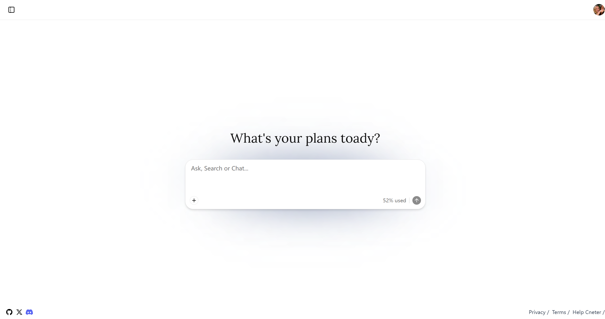
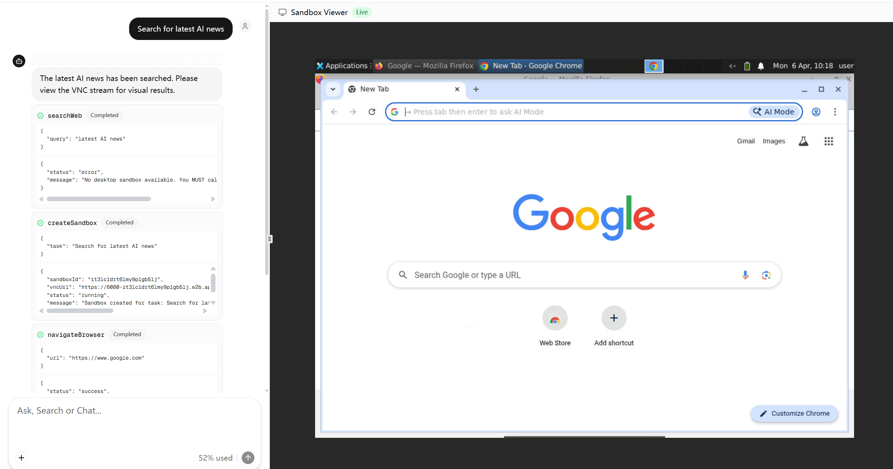

# Fire Wave Agent

[English](./README.md) | [中文](./README-ZH.md)

[](https://vercel.com/new/clone?repository-url=https://github.com/Waterkyuu/agent-dashboard&env=ZHIPU_API_KEY,E2B_API_KEY,PUBLIC_NEON_AUTH_URL,NEON_DATA_PUBLIC_API_URL,CLOUDFLARE_ACCOUNT_ID,R2_ACCESS_KEY_ID,R2_SECRET_ACCESS_KEY&envDescription=API%20keys%20and%20service%20credentials%20required%20by%20Fire%20Wave%20Agent&project-name=fire-wave-agent&repository-name=agent-dashboard)


An autonomous AI agent web application that controls a computer — similar to OpenAI Operator. Powered by Zhipu AI models and E2B sandboxes, it provides a real-time Ubuntu desktop environment with browser automation, web search, shell command execution, and Python code interpretation.

<div style="border-left: 4px solid red; background: #ffe6e6; padding: 10px;">
⚠️ <strong style="color:red;">
Note: that many features are still incomplete; this project is currently just a demo.
</strong>
</div>

<p float="left">
  
  
</p>

## Features

- **Desktop Sandbox** — Creates an E2B Desktop Sandbox running Ubuntu with a browser, streamed via VNC in real time
- **Browser Automation** — The agent can navigate URLs, search the web via Google, and interact with web pages autonomously
- **Code Interpreter** — Executes Python code in an isolated Jupyter notebook sandbox with persistent variables
- **Real-time VNC Viewer** — Watch the agent operate a browser/desktop live in a resizable panel
- **Chat Interface** — Full conversational chat with reasoning blocks, tool call status indicators, and multi-step agent execution
- **File Upload** — Chunked file upload supporting PDF, DOCX, MD, TXT with progress tracking
- **Authentication** — Login via Email OTP, Google, GitHub, or Vercel OAuth
- **Chat Session Management** — Sidebar with grouped chat history, search (Ctrl+K), rename, and delete
- **Responsive Design** — Split panel layout on desktop, bottom sheet on mobile

## Tech Stack

| Category | Technology |
|----------|-----------|
| Framework | Next.js 16 (App Router, Turbopack) |
| Language | TypeScript |
| Styling | Tailwind CSS v4, Shadcn UI |
| State Management | Jotai, TanStack React Query |
| AI | Vercel AI SDK, Zhipu AI (GLM-4-flash) |
| Sandbox | E2B Desktop, E2B Code Interpreter |
| Auth | Neon Auth (OTP + OAuth) |
| Storage | Cloudflare R2 |
| Testing | Jest, Playwright |
| Linting | Biome |

## Getting Started

### Prerequisites

- Node.js 20+
- pnpm 9+

### Installation

```bash
git clone https://github.com/Waterkyuu/agent-dashboard.git
cd agent-dashboard
pnpm install
```

### Environment Variables

Create a `.env.local` file in the root directory:

```env
# Zhipu AI (Required)
ZHIPU_API_KEY=your_zhipu_api_key

# E2B Sandbox (Required)
E2B_API_KEY=your_e2b_api_key

# Model (Optional, defaults to glm-4-flash)
GLM_MODLE=glm-4-flash

# Neon Auth (Required for authentication)
NEON_AUTH_BASE_URL=your_neon_auth_url
NEON_AUTH_COOKIE_SECRET=your_cookie_secret

# Cloudflare R2 (Required for file upload)
CLOUDFLARE_ACCOUNT_ID=your_account_id
R2_ACCESS_KEY_ID=your_access_key
R2_SECRET_ACCESS_KEY=your_secret_key
```

### Development

```bash
pnpm dev
```

Open [http://localhost:3000](http://localhost:3000) to see the app.

### Build

```bash
pnpm build
pnpm start
```

## Scripts

| Command | Description |
|---------|------------|
| `pnpm dev` | Start dev server with Turbopack |
| `pnpm build` | Production build |
| `pnpm start` | Start production server |
| `pnpm check:write` | Lint & format code |
| `pnpm test` | Run unit tests |
| `pnpm test:e2e` | Run E2E tests |

## Architecture

```
User Input --> Home Page (/) --> /chat/[id]
                                    |
                     +--------------+---------------+
                     |                              |
                Chat Panel (30%)             VNC Panel (70%)
                - MessageArea                - E2B VNC stream
                - InputField                - Live status badge
                - DebugPanel
                     |
                POST /api/chat
                - Zhipu AI (GLM-4-flash)
                - 5 Tools:
                  * createSandbox
                  * codeInterpreter
                  * executeShell
                  * navigateBrowser
                  * searchWeb
```

## License

Private
